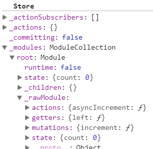

# vuex

## 任务分析

1. 实现插件：$store挂载
2. 实现Store：解析vuex配置，持有state，实现dispatch，commit，getters
3. 借助vue实现数据响应式

## 源码解读

1. 入口文件src/index.js

   ```
   import { Store, install } from './store'
   import { mapState, mapMutations, mapGetters, mapActions, createNamespacedHelpers } from './helpers'
   
   export default {
     Store,	// 主要代码，状态存储
     install,	// 插件安装
     version: '__VERSION__',
     mapState,
     mapMutations,
     mapGetters,
     mapActions,
     createNamespacedHelpers
   }
   ```

2. src/store.js，install方法是Vue.use(Vuex)时候调用，是实现Vue插件的第一步（通用公式）,方法中的_Vue是Vue的构造函数，通过传参方式相比较`import Vue from 'vue'`的优势是不需要将Vue文件打包进来。

   ```
   export function install (_Vue) {
     // 先判断Vue是否已经赋值过，避免重复安装
     if (Vue && _Vue === Vue) {
       if (process.env.NODE_ENV !== 'production') {
         console.error(
           '[vuex] already installed. Vue.use(Vuex) should be called only once.'
         )
       }
       return
     }
     Vue = _Vue
     applyMixin(Vue)
   }
   ```

3. applyMixin(Vue)在src/mixin.js中

   ```
   export default function (Vue) {
     const version = Number(Vue.version.split('.')[0])
     // 区分Vue版本，2.x和1.x的钩子不同
     if (version >= 2) {
       // 全局混入，beforeCreate钩子将在每个Vue实例调用，因此可能会调用很多次
       Vue.mixin({ beforeCreate: vuexInit })
     } else {
       // override init and inject vuex init procedure
       // for 1.x backwards compatibility.
       const _init = Vue.prototype._init
       Vue.prototype._init = function (options = {}) {
         options.init = options.init
           ? [vuexInit].concat(options.init)
           : vuexInit
         _init.call(this, options)
       }
     }
   
     /**
      * Vuex init hook, injected into each instances init hooks list.
      */
     // 给vue的实例注册一个$store的属性，类似使用vue.$route
     function vuexInit () {
       const options = this.$options
       // 根实例，直接将store赋值给this.$store
       if (options.store) {
         this.$store = typeof options.store === 'function'
           ? options.store()
           : options.store
       } else if (options.parent && options.parent.$store) {
         // 否则拿parent上的$store,逐层往下赋值，从而实现所有组件共用同个store
         this.$store = options.parent.$store
       }
     }
   }
   ```

4. 初始化src/store.js，调用Store构造，传入一个对象，包含state,mutations,actions,getters等

   ```
   constructor (options = {}) {
   
       // 挂载在window上的自动安装，也就是通过script标签引入时不需要手动调用Vue.use(Vuex)
       if (!Vue && typeof window !== 'undefined' && window.Vue) {
         install(window.Vue)
       }
   
       if (process.env.NODE_ENV !== 'production') {
       
         // 确保在我们实例化 Store之前，vue已经存在
         assert(Vue, `must call Vue.use(Vuex) before creating a store instance.`)
         
         // 检测是否支持Promise,因为vuex中使用了Promise，Promise是es6的语法，但是有的浏览器并不支持es6所以我们需要在package.json中加入babel-polyfill用来支持es6
         assert(typeof Promise !== 'undefined', `vuex requires a Promise polyfill in this browser.`)
         
         // 必须使用new操作符调用Store函数
         assert(this instanceof Store, `store must be called with the new operator.`)
       }
   
       const {
         plugins = [],
         strict = false
       } = options
   
       // store internal state
       // 提交状态的标志，在_withCommit中，当使用mutation时，会先赋值为true，再执行mutation，修改state后再赋值为false，在这个过程中，会用watch监听state的变化时是否_committing为true，从而保证只能通过mutation来修改state
       this._committing = false
       this._actions = Object.create(null)	// 存储所有actions
       this._actionSubscribers = []	// 用于保存订阅action的回调
       this._mutations = Object.create(null)	// 保存所有的mutation
       this._wrappedGetters = Object.create(null)	// 保存所有getters
       this._modules = new ModuleCollection(options)
       this._modulesNamespaceMap = Object.create(null)
       this._subscribers = []	// 用于监听mutation
       this._watcherVM = new Vue()	// 用于响应式地监测一个 getter 方法的返回值
       this._makeLocalGettersCache = Object.create(null)
   
       // bind commit and dispatch to self
       const store = this
       const { dispatch, commit } = this
       this.dispatch = function boundDispatch (type, payload) {
         return dispatch.call(store, type, payload)
       }
       this.commit = function boundCommit (type, payload, options) {
         return commit.call(store, type, payload, options)
       }
   
       // strict mode
       this.strict = strict
   
       const state = this._modules.root.state
   
       // module处理的核心，包括处理根module、action、mutation、getters和递归注册子module
       installModule(this, state, [], this._modules.root)
   
       // 使用vue实例来保存state和getter
       resetStoreVM(this, state)
   
       // 插件注册
       plugins.forEach(plugin => plugin(this))
   
       const useDevtools = options.devtools !== undefined ? options.devtools : Vue.config.devtools
       if (useDevtools) {
         devtoolPlugin(this)
       }
     }
   ```

   ## 总结

   整个Vuex初始化分为以下几个步骤

   1. install（在Vue.use(Vuex)里调用）：接收Vue构造（优点：不需要打包Vue进来），实现一个beforeCreate全局混入（在组件初始化时调用），在beforeCreate钩子中拿到当前组件实例并取出store赋值给this.$store，且所有的组件实例均执行此操作，因此所有组件实例都能通过this.$store获取到store

   2. 执行Store构造

      - 注册Module，并形成Module树：this._modules = new ModuleCollection(options)

      

      - 绑定dispatch、commit的上下文call(store,  ...）防止上下文对象丢失
      - 处理所有的模块：installModule(this, state, [], this._modules.root)
        - 将模块中的mutations赋值给this._mutations
        - 将模块中的actions赋值给this._actions
        - 将模块中的getters赋值给this._wrappedGetters
      - 数据响应化：resetStoreVM(this, state)
        - 将this._wrappedGetters中的函数执行，将属性和结果赋值给this.getters
        - 通过创建Vue实例实现state和getters的数据响应化